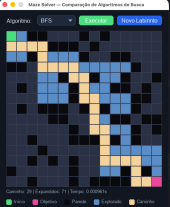
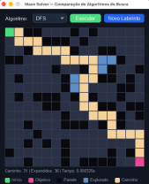

# Universidade Federal da Grande Dourados

**Disciplina:** Inteligência Artificial
**Docente:** Alexandre Augusto Angelo de Souza

# Trabalho — P1

## 1. Objetivo

O objetivo deste trabalho é implementar e comparar três algoritmos clássicos de busca em grafos/espaço de estados — **Busca em Largura (BFS)**, **Busca em Profundidade (DFS)** e **Busca A\* (A-estrela)** — aplicados ao problema de encontrar um caminho entre uma célula de origem e uma célula de destino dentro de um labirinto representado como uma grade (matriz) de células livres e obstáculos.

Ao final da atividade, cada aluno(a) deve ser capaz de:

1. implementar corretamente os três algoritmos de busca;
2. executá-los sobre o mesmo labirinto e visualizar o comportamento de cada um — quais células foram exploradas e qual caminho foi encontrado; e
3. comparar os resultados obtidos em termos de tamanho do caminho encontrado, número de células expandidas e tempo de execução.

## 2. A aplicação disponibilizada

Foi disponibilizada uma aplicação gráfica já pronta, feita em Python com a biblioteca **pygame**, que gera labirintos aleatórios, desenha o tabuleiro na tela e permite escolher e executar um algoritmo de busca por meio de uma interface simples com uma caixa de seleção e dois botões.

Toda a parte de geração do labirinto, desenho na tela, animação e interação com o mouse já está implementada. O trabalho está concentrado **exclusivamente na lógica de busca**, ou seja, em como percorrer o labirinto para encontrar o caminho entre o início e o objetivo. Não é necessário escrever nenhuma linha de código relacionada a desenho, cores, eventos de mouse ou geração do labirinto.

### 2.1. Como a interface funciona

- **Caixa de seleção "Algoritmo"**: permite escolher qual algoritmo será executado: BFS, DFS ou A\*.
- **Botão "Executar"**: executa, sobre o labirinto atual, a função do algoritmo selecionado na caixa de seleção e exibe o resultado na tela, com animação.
- **Botão "Novo Labirinto"**: gera um novo labirinto aleatório, com novos obstáculos e novos caminhos possíveis entre início e objetivo, e limpa o resultado da execução anterior.
- **Área de estatísticas (rodapé)**: mostra o tamanho do caminho encontrado (*Caminho*), a quantidade de células expandidas pela busca (*Expandidos*) e o tempo de execução em segundos (*Tempo*).
- **Legenda de cores**: explica o significado de cada cor desenhada no tabuleiro.

### 2.2. Legenda de cores do tabuleiro

Durante e após a execução de um algoritmo, cada célula do labirinto é representada com uma cor que indica o seu papel na busca:

| Cor | Significado |
|---|---|
| 🟩 **Início** | célula de origem (`maze.inicio`) |
| 🟥 **Objetivo** | célula de destino (`maze.objetivo`) |
| ⬛ **Parede** | obstáculo, não pode ser atravessado |
| 🟦 **Explorado** | células visitadas (expandidas) pelo algoritmo durante a busca |
| 🟪 **Caminho** | sequência final de células do início ao objetivo |

> **Observação:** nas capturas de tela a seguir, a célula do objetivo aparece coberta pela cor do caminho quando ele é alcançado (rosa/vermelho por baixo); e as células azuis mostram exatamente a ordem/área de expansão de cada algoritmo — repare como esse padrão muda bastante entre BFS, DFS e A\*, mesmo usando o mesmo labirinto.

### 2.3. Exemplos de execução (mesmo labirinto, três algoritmos)

As capturas abaixo mostram o resultado da execução dos três algoritmos sobre o mesmo labirinto de teste, já com a implementação de referência concluída. Elas servem como parâmetro do que se espera visualmente ao final da implementação.

Perceba que:
- **A\*** (Figura 1) e **BFS** (Figura 2) encontram o caminho mais curto (**29 células**), explorando um número parecido de células (**71**);
- **DFS** (Figura 3) encontra um caminho mais longo (**31 células**), mas explorando um número bem menor de células (**36** contra 71).


*Figura 1 — Execução do algoritmo A\* (Caminho: 29 | Expandidos: 71).*



*Figura 2 — Execução do algoritmo BFS (Caminho: 29 | Expandidos: 71).*



*Figura 3 — Execução do algoritmo DFS (Caminho: 31 | Expandidos: 36).*

## 3. Estrutura dos arquivos do projeto

O projeto é composto por quatro arquivos Python. A tabela abaixo resume o papel de cada um e deixa claro onde pode e onde não deve haver alteração de código.

| Arquivo | O que faz | Pode alterar? |
|---|---|---|
| `main.py` | Ponto de entrada da aplicação. Cria a janela pygame, monta a caixa de seleção e os botões, mantém o loop principal (captura de eventos, animação e desenho a cada quadro) e chama a função do algoritmo escolhido quando o botão "Executar" é clicado. | **NÃO** |
| `ui.py` | Componentes visuais reutilizáveis: cores da paleta, classes `Botão` e `Dropdown`, a função `desenhar_tabuleiro` (que pinta cada célula do labirinto de acordo com as listas de exploradas/caminho) e `desenhar_legenda`. | **NÃO** |
| `maze.py` | Define a classe `Maze` (a grade do labirinto, início, objetivo e os métodos `eh_valida`, `eh_livre` e `vizinhos`) e a função `gerar_labirinto`, que cria labirintos aleatórios garantidamente solúveis. | **NÃO** |
| `algorithms.py` | Onde os três algoritmos de busca (`bfs`, `dfs`, `astar`) devem ser implementados. Já contém a assinatura das funções, os TODOs com o roteiro sugerido, a função utilitária `reconstruir_caminho` e a heurística de Manhattan (`heuristica`) prontas para uso. | **SIM — Deve** |

> **Importante:** os arquivos `main.py`, `ui.py` e `maze.py` já estão prontos e testados. **NÃO** precisa (e não deve) alterá-los para a implementação básica do trabalho — toda a entrega consiste em completar as três funções de `algorithms.py`. Alterar os outros arquivos pode quebrar a interface e prejudicar a correção.

## 4. Como interagir com as classes já definidas

Para implementar os algoritmos, não é necessário entender os detalhes internos de `main.py` e `ui.py`, apenas saber como usar a interface (API) que `maze.py` e `algorithms.py` já oferecem prontas. Essa é a única parte de "desenho"/interface que interessa aos algoritmos: as listas `explorados` e `caminho`, que a busca devolve dentro de um `SearchResult`, são o que a aplicação usa para colorir o tabuleiro — a busca em si não desenha nada.

### 4.1. A classe `Maze` (definida em `maze.py`)

Cada célula do labirinto é representada como uma tupla `(linha, coluna)`, o tipo `Coord`. O objeto `maze` recebido por cada função de busca expõe:

- `maze.inicio`: tupla `(linha, coluna)` com a célula de origem.
- `maze.objetivo`: tupla `(linha, coluna)` com a célula de destino.
- `maze.vizinhos(celula)`: devolve a lista de células vizinhas válidas e livres (cima, baixo, esquerda, direita) de `celula`. Use sempre este método para expandir uma célula — ele já filtra limites do tabuleiro e paredes.
- `maze.eh_livre(celula)` e `maze.eh_valida(celula)`: verificações auxiliares (normalmente não é preciso chamá-las diretamente, pois `vizinhos` já as usa internamente).
- `maze.linhas` e `maze.colunas`: dimensões do tabuleiro.

**NÃO** precisa (e não deve) alterar `maze.py`; toda a interação com o labirinto dentro dos algoritmos deve ser feita através desses atributos e métodos.

### 4.2. A classe `SearchResult` (`algorithms.py`)

Cada função de busca deve devolver uma instância de `SearchResult`, já definida como um dataclass, com os seguintes campos:

```python
@dataclass
class SearchResult:
    encontrado: bool        # True se um caminho até o objetivo foi achado
    caminho: List[Coord]    # sequência de células do início ao objetivo (inclusive)
    explorados: List[Coord] # células visitadas, na ordem em que foram exploradas
    expandidos: int         # quantidade de células expandidas (nós processados)
    tempo: float             # tempo de execução em segundos
```

É esse objeto que a aplicação usa para desenhar a animação de exploração (`explorados`) e do caminho final (`caminho`), e para preencher a linha de estatísticas no rodapé (Caminho / Expandidos / Tempo). Por isso é importante preencher todos os campos corretamente, mesmo quando nenhum caminho é encontrado (nesse caso, `encontrado=False` e `caminho=[]`).

### 4.3. Funções utilitárias (usem!)

- `reconstruir_caminho(veio_de, inicio, objetivo)`: a partir de um dicionário `veio_de` (onde `veio_de[celula]` guarda de qual célula se chegou até `celula`), reconstrói e devolve a lista de células do início até o objetivo, na ordem correta. Deve ser usada nas três buscas ao encontrar o objetivo.
- `heuristica(a, b)`: distância de Manhattan entre duas células; já pronta para uso em `astar`, como `h(n) = heuristica(n, maze.objetivo)`.

### 4.4. Sobre a interface gráfica (`ui.py` e `main.py`)

Como mencionado, toda a parte de desenho é controlada pela aplicação, e é totalmente automática a partir do momento em que um `SearchResult` é devolvido pela função do algoritmo (`bfs`, `dfs` ou `astar`). O `main.py` se encarrega de animar a exploração célula a célula e chamar `ui.desenhar_tabuleiro` para colorir o tabuleiro de acordo com as listas `explorados` e `caminho`. É necessário entender essa relação de "entrada e saída"; não é necessário nem esperado ler `ui.py` em detalhe.

## 5. O que deve ser implementado (`algorithms.py`)

Devem ser implementadas as três funções abaixo, todas com a mesma assinatura — recebem um objeto `Maze` e devolvem um `SearchResult` — substituindo o `raise NotImplementedError(...)` de cada uma pela lógica de busca correspondente. Os comentários e TODOs já presentes em `algorithms.py` trazem um roteiro passo a passo; um resumo de cada algoritmo segue abaixo.

### 5.1. `bfs(maze)` — Busca em Largura

Explora o labirinto "em camadas", sempre processando primeiro as células descobertas há mais tempo (estrutura FIFO — fila). Estrutura sugerida: `collections.deque`, com `append` para inserir e `popleft` para retirar. Como todas as arestas têm o mesmo custo (um passo), a BFS garante encontrar o caminho mais curto em número de células.

### 5.2. `dfs(maze)` — Busca em Profundidade

Segue por um caminho até não poder mais avançar, antes de voltar (*backtrack*) e tentar outro ramo. Estrutura sugerida: pilha (lista Python com `append`/`pop` — estrutura LIFO). Diferente da BFS, a DFS não garante o caminho mais curto, mas costuma expandir menos células em labirintos como os deste projeto.

### 5.3. `astar(maze)` — Busca A\*

Combina o custo já percorrido com uma estimativa do custo restante, expandindo sempre a célula de menor `f(n) = g(n) + h(n)`, onde `g(n)` é o número de passos do início até `n`, e `h(n) = heuristica(n, maze.objetivo)` é a distância de Manhattan até o objetivo (já implementada). Estrutura sugerida: fila de prioridade (`heapq`), inserindo tuplas `(f, contador, celula)` — o contador evita comparar células diretamente em caso de empate de `f`.

### 5.4. Roteiro comum às três buscas

- Inicialize a fronteira (fila, pilha ou fila de prioridade, conforme o algoritmo) apenas com `maze.inicio`;
- Mantenha um conjunto/dicionário de células já conhecidas, para nunca inserir a mesma célula duas vezes na fronteira;
- A cada iteração, retire a próxima célula da fronteira e registre-a em `explorados` (isso é o que pinta o tabuleiro de azul na animação);
- Se essa célula for `maze.objetivo`, reconstrua o caminho com `reconstruir_caminho` e devolva o `SearchResult` com `encontrado=True`;
- Caso contrário, percorra `maze.vizinhos(celula)`; para cada vizinho ainda não conhecido, marque-o como conhecido, guarde em `veio_de` de qual célula ele foi alcançado e insira-o na fronteira;
- Se a fronteira esvaziar sem alcançar o objetivo, devolva um `SearchResult` com `encontrado=False` e `caminho=[]`.

Use `time.perf_counter()` no início e no fim de cada função (já importado e iniciado como `inicio_tempo`) para preencher corretamente o campo `tempo` do resultado.

## 6. Execução e testes

Para rodar a aplicação (após implementar ao menos um dos algoritmos):

```bash
pip install -r requirements.txt
python main.py
```

Recomenda-se testar cada algoritmo implementado em pelo menos 3 a 5 labirintos diferentes, usando o botão "Novo Labirinto", para verificar se o caminho encontrado é sempre válido (não atravessa paredes) e se o comportamento observado é coerente com o esperado para cada algoritmo (por exemplo: BFS e A\* devem encontrar o menor caminho possível, e a DFS não necessariamente).

## 7. Critérios de avaliação

- **Corretude**: cada algoritmo encontra um caminho válido (quando existe) entre início e objetivo, respeitando as regras de movimentação (4 direções, sem atravessar paredes, **não é permitido movimento em diagonal**);
- **Fidelidade ao algoritmo**: uso da estrutura de dados apropriada a cada busca (fila para BFS, pilha/recursão para DFS, fila de prioridade para A\*), sem misturar comportamentos entre elas;
- **Uso correto das classes fornecidas**: uso de `maze.vizinhos`, reconstrução do caminho com `reconstruir_caminho`, e preenchimento completo e coerente de `SearchResult` (incluindo o caso de caminho não encontrado);
- **Qualidade do código**: clareza, organização e, quando fizer sentido, comentários explicando as decisões tomadas;
- **Não alteração** dos arquivos prontos `main.py`, `ui.py` e `maze.py`, que devem permanecer como foram entregues.

## 8. Entrega

Cada dupla deve entregar:

- O arquivo `algorithms.py` completo, com as três funções (`bfs`, `dfs` e `astar`) implementadas e funcionando, sem alterações nos demais arquivos do projeto.
- Uma captura de tela do resultado de cada algoritmo (semelhante às da seção 2.3), executado sobre o mesmo labirinto, para permitir a comparação entre eles.
- Somente esses dois arquivos devem ser entregues: `algorithms.py` e o arquivo com as capturas de tela.
