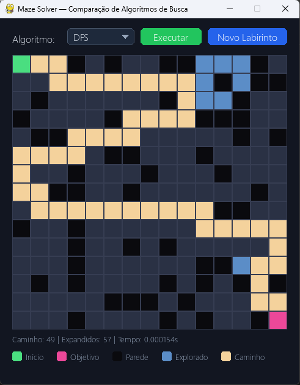
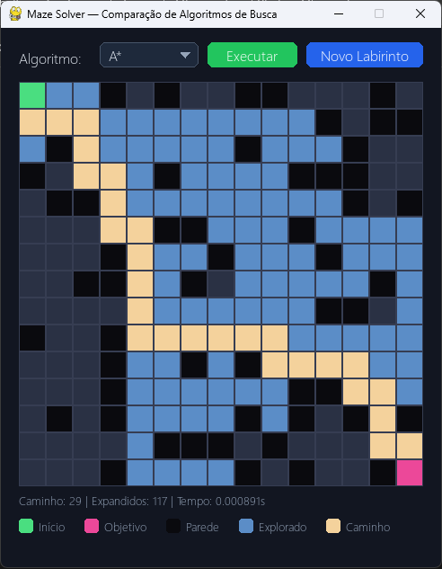

# 🧩 Maze AI — Evaluation of Search Algorithms

<p align="center">
  <em>Academic project for the Artificial Intelligence course — UFGD 🎓</em>
</p>


---

This repository presents the implementation and analysis of three classic search algorithms applied to solving mazes:

- 🔵 Breadth-First Search — **BFS**
- 🟠 Depth-First Search — **DFS**
- 🟣 A* Search — **A-Star**

The project uses a graphical interface in `pygame` to generate mazes, choose the search algorithm, and visualize the explored cells, the path found, and execution metrics.

---

## 🎯 Objective

- ✅ Implement the BFS, DFS, and A* algorithms;
- ✅ Apply graph search concepts to a practical problem;
- ✅ Compare the behavior, efficiency, and quality of the solutions;
- ✅ Visualize the exploration process and the final path in the maze;
- ✅ Develop an understanding of the concepts studied in the Artificial Intelligence course.

---

## ✨ Features

The activity evaluates the ability to correctly implement search strategies and interpret their results.

- **BFS:** finds the shortest path in unweighted graphs;
- **DFS:** finds a valid path, but does not guarantee the shortest solution;
- **A\*:** uses a heuristic to prioritize potentially more promising paths;
- **Metrics:** number of nodes expanded, cells explored, path obtained, and execution time.

---

## 🛠 How to Use the Repository

📥 1. Clone the repository with Git:

```bash
git clone https://github.com/jimmykiedis/TicTacToeAB.git
cd Labirinto
```

---

🔗 2. Install the project and its dependencies:

```bash
python -m pip install .
```

During development, you can also install the project in editable mode:

```bash
python -m pip install -e .
```

### 2. Run the application

```bash
python main.py
```

Upon startup, a window will be displayed containing:

- 🧱 A randomly generated maze;
- 🟢 The starting point;
- 🔴 The goal;
- ⬛ Obstacles and free cells;
- 📋 A selector to choose between `BFS`, `DFS`, and `A*`;
- ▶️ A button to run the search;
- 🔄 A button to generate a new maze;
- 📊 Statistics and a visual legend of the run.

---

## 🏗️ Implementation Strategy

The graphical interface, maze generation, controls, and visualization were provided as a starting base by the instructor. As a result, the main development focus was concentrated on `algorithms.py`.

Each algorithm receives a `Maze` object and returns a `SearchResult` with the information needed for the interface to display the result:

```python
def bfs(maze: Maze) -> SearchResult: ...
def dfs(maze: Maze) -> SearchResult: ...
def astar(maze: Maze) -> SearchResult: ...
```

The search result contains:

- `found`: indicates whether the goal was reached;
- `path`: sequence of cells between the start and the goal;
- `explored`: cells visited during execution;
- `expanded`: number of nodes processed;
- `time`: duration of the search.

---

## 🖼️ Execution Examples

### 🔵 BFS — shortest breadth-first solution


BFS found a shortest path of **29 cells**, exploring **71 cells**.

### 🟠 DFS — valid path, but generally less efficient



DFS found a path of **31 cells**, exploring fewer nodes in this scenario, but with no guarantee of producing the shortest solution.

### 🟣 A* — short path with efficient expansion



A* found a path of **29 cells**, combining graph exploration with a heuristic to guide the search.

---

## 🛠️ Technologies

| Technology | Use in the project |
|---|---|
| **Python 3.10+** | Main language of the project |
| **Pygame 2.5+** | Graphical interface and maze rendering |
| **Pyproject.toml** | Dependency management and project configuration |

---

## 📁 Project Structure

```text
Labirinto/
├── Docs/
│   ├── media/
│   │   ├── figura1-bfs.png
│   │   ├── figura2-dfs.png
│   │   └── figura3-astar.png
│   └── Trabalho_P1.md
├── .gitignore
├── algorithms.py     # Implementation of the search algorithms
├── main.py           # Application entry point
├── maze.py           # Maze representation and generation
├── pyproject.toml    # Metadata and dependencies
├── README.md         # Project documentation
└── ui.py             # Graphical interface and visual components
```

---

## 📝 Final Notes

The visual and structural base of the project was provided by professor **Alexandre Augusto Angelo de Souza**, from the **Federal University of Grande Dourados (UFGD)**.

The authors were responsible for the code implementation of the search algorithms, using the structure provided for the graded assignment.

### 👨‍💻 Implementation

- [Leonardo Farias de Oliveira](https://github.com/Jotshh)
- [Josiel Phelipe Oliveira Franco](https://github.com/jimmykiedis)

---

## 📄 License

Academic project developed for educational purposes in the **Artificial Intelligence — UFGD** course.

Feel free to consult and study the code. If you reuse it, please keep proper credit to the authors and the institution.